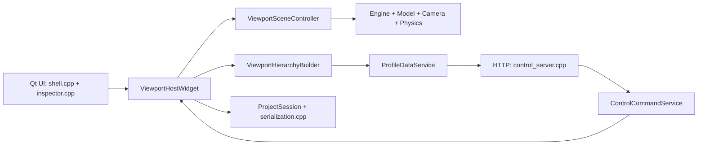
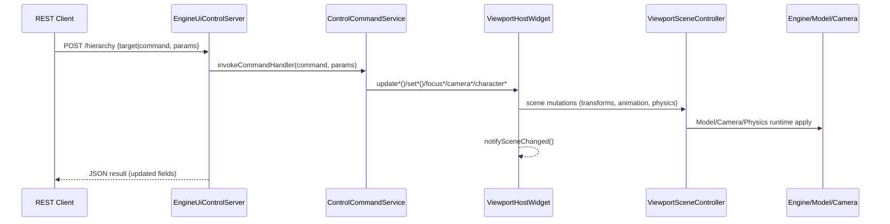
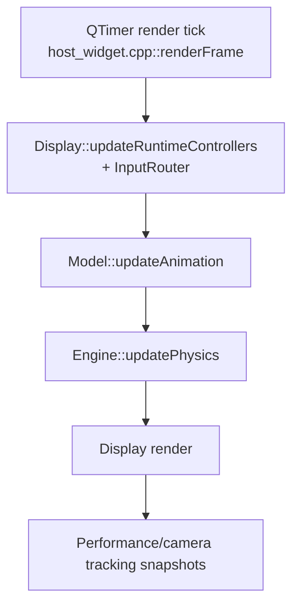
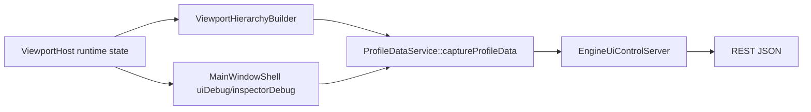
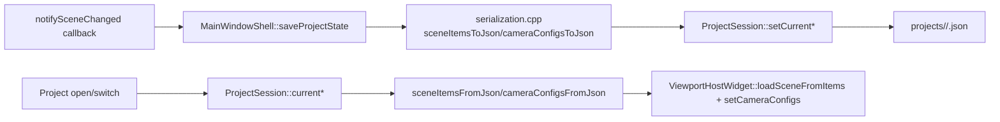

# DATAFLOW

This document maps how control/data moves through the editor/runtime.

## 1) High-level map



## 2) Control command flow (`/hierarchy` and `/controls/*`)



### Command routing details

- HTTP parsing and command dispatch: `control_server.cpp`
- Handler registry and command fanout: `control_command_service.cpp`
- Scene-item mutation path: `control_command_service_scene.cpp` -> `host_widget.cpp` -> `scene_controller.cpp`
- Camera mutation path: `control_command_service_camera.cpp` -> `host_widget.cpp` (camera config/runtime)
- Physics/coupling path: `control_command_service_physics.cpp` + scene/controller/model APIs

## 3) UI interaction flow (local editor controls)

```mermaid
flowchart LR
    Widgets[Inspector widgets\n(shell.cpp / inspector.cpp)] --> HostCalls[viewportHost->update...]
    HostCalls --> SceneCtrl[ViewportSceneController]
    SceneCtrl --> RuntimeApply[Model/Camera/Physics runtime apply]
    RuntimeApply --> Changed[notifySceneChanged]
    Changed --> Save[MainWindowShell::setSceneChangedCallback -> saveProjectState]
```

### Notes

- Most inspector edits call `viewportHost->update...` directly.
- `notifySceneChanged()` triggers persistence callback registered in `shell.cpp`.
- Scene item persistence uses `sceneItemsToJson()/sceneItemsFromJson()` in `serialization.cpp` and `ProjectSession` writes.

## 4) Runtime tick flow (input -> animation -> physics -> render)



### Input/WASD routing

- Input capture and mode routing: `input_router.cpp`
- Mode rules: `input_mode_rules.h`
- Camera mode semantics: `camera.cpp`, `host_widget.cpp` camera config/mode updates
- Character ownership and explicit enablement: `host_widget.cpp::enableCharacterControl()` and related control handlers

## 5) Profile/readback flow (`GET /profile/*`, `GET /hierarchy`)



### Important payload groups

- Hierarchy tree JSON: `ViewportHierarchyBuilder::hierarchyJson()`
- Scene/runtime profile JSON: `ViewportHierarchyBuilder::sceneProfileJson()`
- "Controls data" readback (`/profile/input_state`): `ProfileData.cameraTracking`
- Motion debug frame/summary/overlay: host widget debug capture + `/profile/motion_state`
- Combined hierarchy + settings dump: `GET /hierarchy`

## 6) Persistence flow (project/session)



## 7) Animation-specific path (including trim/centroid controls)

```mermaid
flowchart LR
    CmdOrUI[UI inspector or REST scene_item/animation command]
      --> HostAnim[updateSceneItemAnimationState + updateSceneItemAnimationProcessing]
    HostAnim --> SceneAnim[ViewportSceneController stores SceneItem + applies Model settings]
    SceneAnim --> ModelAnim[Model::setAnimationPlaybackState + setAnimationProcessingOptions]
    ModelAnim --> FbxRt[animation.cpp FbxRuntime\n(clip, play/loop/speed, trim window, centroid normalization)]
    FbxRt --> FrameVerts[per-frame evaluated animation vertices + skinning]
```

## 8) Existing focused doc

For deeper motion/camera tracking internals, see `MOTION_AND_TRACKING_DATAFLOW.md`.
