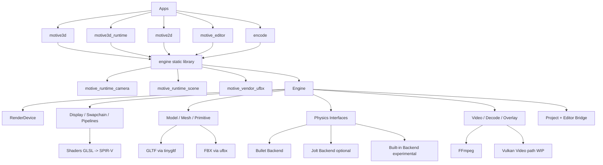

# motive engine
[output.webm](https://github.com/user-attachments/assets/96396c17-7bf0-4f21-9431-b2776833bf23)

This simple game engine was vibe coded by me to make it easier to develop games using my comfortable coding setups. There is already a decent render pipeline with z-culling etc. and you can fly about the scene using WASD and right-click (like familiar Game Engines). 

## Architecture

See the full architecture document: [ARCHITECTURE.md](ARCHITECTURE.md)



## Getting started
1) Clone this repository with submodules ```git clone https://github.com/juliancoy/motive && cd motive && git submodule update --init --recursive```
2) run ```python build_deps.py``` to build the dependencies
3) ```./build.sh```
4) ```./build/motive3d``` (Qt shell with tabs/panels)

Standalone runtime app:
- `./build.sh --full`
- `./build/motive3d_runtime --gltf`

That aught to do it. There might be some wrinkles. 

## Design Notes
### Dependencies
1) glfw - Creates a window with mouse and keyboard input
2) glm - Some useful functions and structs for transformations in space
3) tinygltf - A library to open GLTF and GLB model files
4) Vulkan - The successor to OpenGL; A modern GPU interface

### engine.cpp
This 2500-line file implements the engine. Don't ask me, I vibe-coded it.

### Python
This is the next frontier: see how valuable a Python interface to the CPP is
